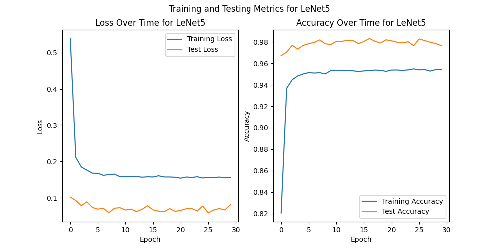
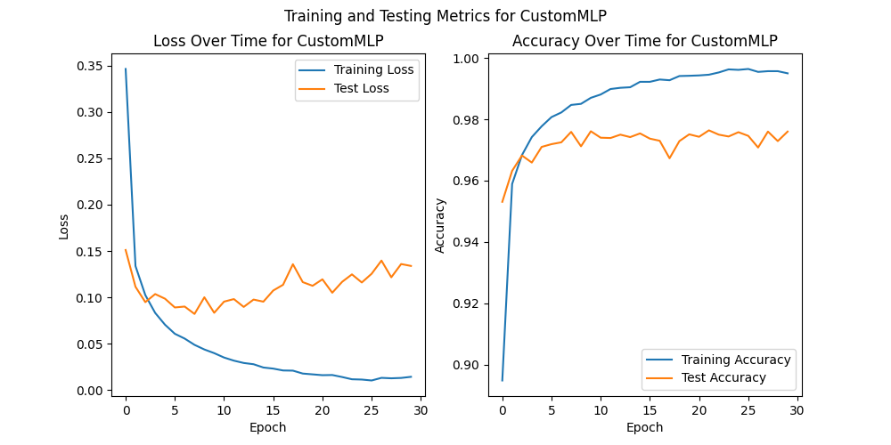

# deep-learning
## 24-1학기 인공신경망과 딥러닝

### **1. Describe the number of model parameters of LeNet-5 and your custom MLP and how to compute them.**

#### leNet-5와 CustomMLP의 파라미터 수 비교
#### LeNet-5

    Convolution Layer 1: 1 x 6 x (5 x 5) + 6 = 156

    Convolution Layer 2: 6 x 16 x (5 x 5) + 16 = 2,416

    Fully Connected Layer 1: (16 x 5 x 5) x 120 + 120 = 48,120

    Fully Connected Layer 2: 120 x 84 + 84 = 10,164

    Fully Connected Layer 3: 84 x 10 + 10 = 850

#### CustomMLP

    Fully Connected Layer 1: (32 x 32) x 60 = 61,440

    Fully Connected Layer 2: 60 x 32 = 1,920

    Fully Connected Layer 3: 32 x 10 = 320

**CustomMLP의 총 파라미터 수는 다음과 같다.**
    61,440 + 1,920 + 640 = 63,680

### **2. Plot average loss and accuracy for training and testing.**
**LeNet-5와 CustomNLP Plot 비교**

### **3. Compare the predictive performance of LeNet-5 and your custom MLP.**
**LeNet-5와 CustomNLP ACC 비교(최고 성능 기준)**

    ||LeNet-5|CustomMLP|
    |--|--|--|
    |ACC(%)|0.9831|0.9764|

### **4. Employ at least more than two regularization techniques to improve LeNet-5 model.**

- **Dropout**

- **L2 regularization(Weight decay)**

    ||LeNet-5(Reg)|LeNet-5(without Reg)|
    |--|--|--|
    |ACC(%)|0.9831|0.9932|

    정규화 후 오히려 성능이 아주 약간 감소하는 것을 확인할 수 있음. 
